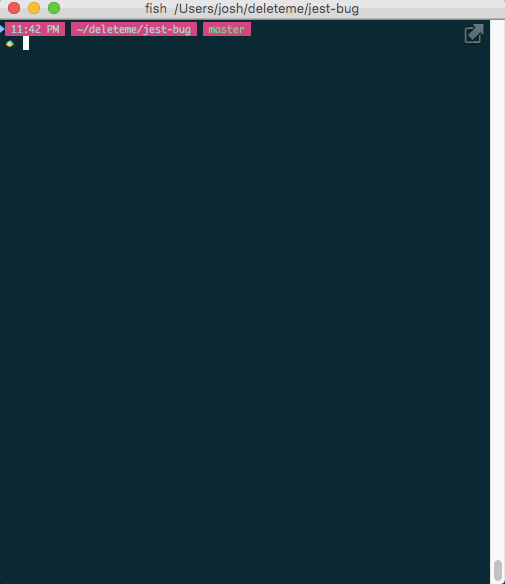

Jest bug: `--bail` does not work
================================

Making this so that the issue is easily
reproducible for the maintainers.


Description
-----------

The [package.json](package.json) defines a test script set to bail: `jest --bail`

Jest's help page says this about the `--bail` flag:

> Exit the test suite immediately upon the first failing test.

However, when I run `npm test`, it keeps running the tests
after the first failure.


Steps to reproduce
------------------

```sh
# Install deps
npm install

# run the tests
npm test
```

**Expected:** Exit the test suite after the test named "2: fail".

**Actual:** Runs the full test suite.

Narrated
--------

So it's easier to see without having to clone and run things.


